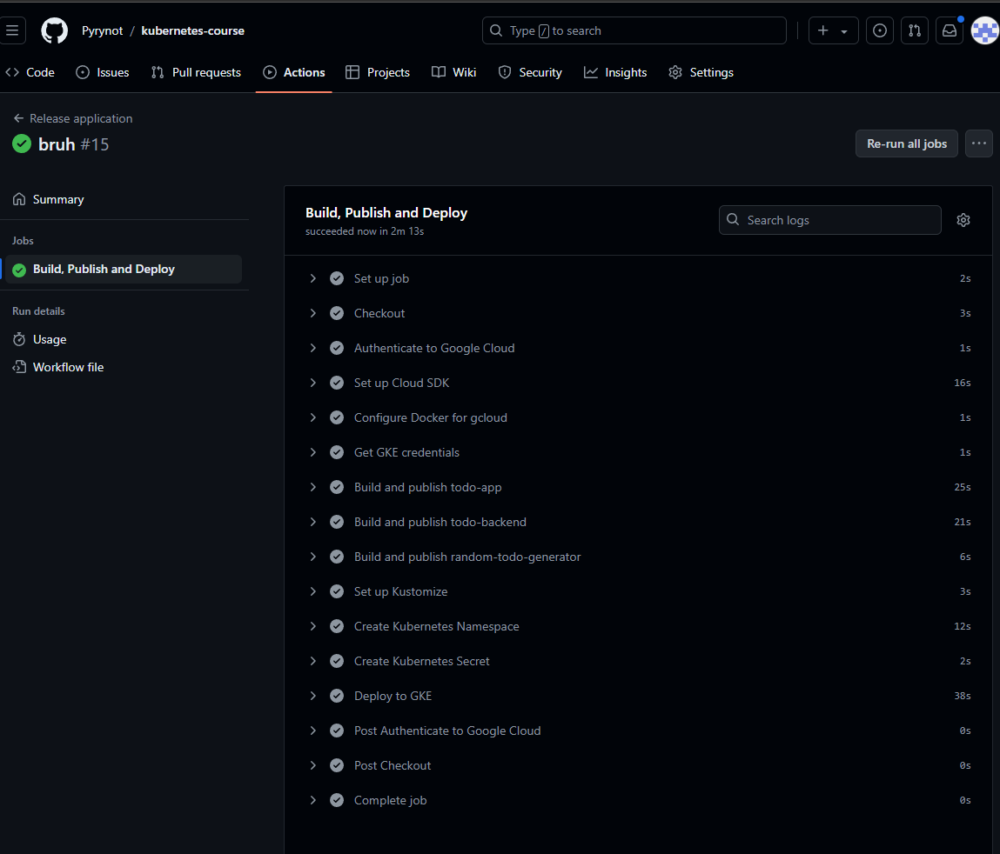

# Commands used:

CI/CD pipeline:



Checking resources:
```console
$ kubectl get all
NAME                                           READY   STATUS      RESTARTS   AGE
pod/postgres-ss-0                              1/1     Running     0          29m
pod/random-todo-generator-manual-6khkh-z79v2   0/1     Completed   0          3m35s
pod/todo-app-dep-7969f6b6bc-lm48x              2/2     Running     0          9m35s

NAME                   TYPE        CLUSTER-IP       EXTERNAL-IP   PORT(S)                         AGE
service/postgres-svc   ClusterIP   None             <none>        5432/TCP                        29m
service/todo-app-svc   NodePort    34.118.234.117   <none>        8010:31357/TCP,8000:32493/TCP   29m

NAME                           READY   UP-TO-DATE   AVAILABLE   AGE
deployment.apps/todo-app-dep   1/1     1            1           29m

NAME                                      DESIRED   CURRENT   READY   AGE
replicaset.apps/todo-app-dep-7967bfdb5f   0         0         0       20m
replicaset.apps/todo-app-dep-7969f6b6bc   1         1         1       9m35s
replicaset.apps/todo-app-dep-9645b8487    0         0         0       29m
replicaset.apps/todo-app-dep-bfff79f      0         0         0       15m

NAME                           READY   AGE
statefulset.apps/postgres-ss   1/1     29m

NAME                                  SCHEDULE    SUSPEND   ACTIVE   LAST SCHEDULE   AGE
cronjob.batch/random-todo-generator   0 * * * *   False     0        <none>          29m

NAME                                           COMPLETIONS   DURATION   AGE
job.batch/random-todo-generator-manual-6khkh   1/1           8s         3m35s
```

Curling the address:
```console
$ curl http://34.54.19.90/todos
[{"content":"df"},{"content":"Read https://en.wikipedia.org/wiki/WDEX"}](.venv)

$ curl -X POST http://34.54.19.90/todos -H "Content-Type: application/json" -d '{"content": "I hate the cloud"}'
{"content":"I hate the cloud"}(.venv) 

$ curl http://34.54.19.90/todos
[{"content":"df"},{"content":"Read https://en.wikipedia.org/wiki/WDEX"},{"content":"I hate the cloud"}](.venv) 
```