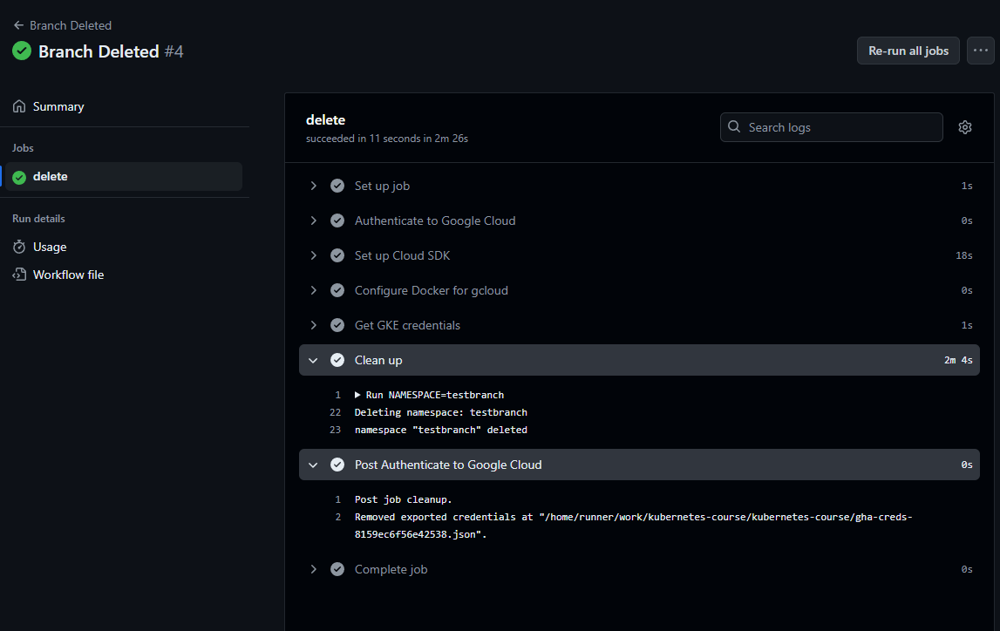
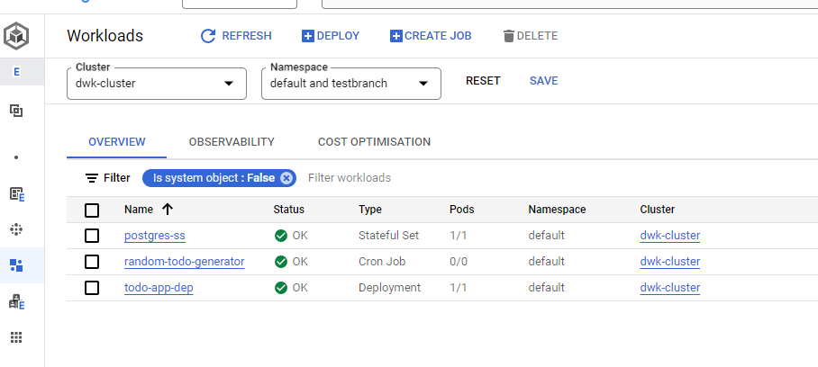

```console
$ git branch -d testbranch
Deleted branch testbranch (was d5caf72).

$ git push origin --delete testbranch
To https://github.com/Pyrynot/kubernetes-course.git
 - [deleted]         testbranch
```

Job completed:



Namespace testbranch gone:

