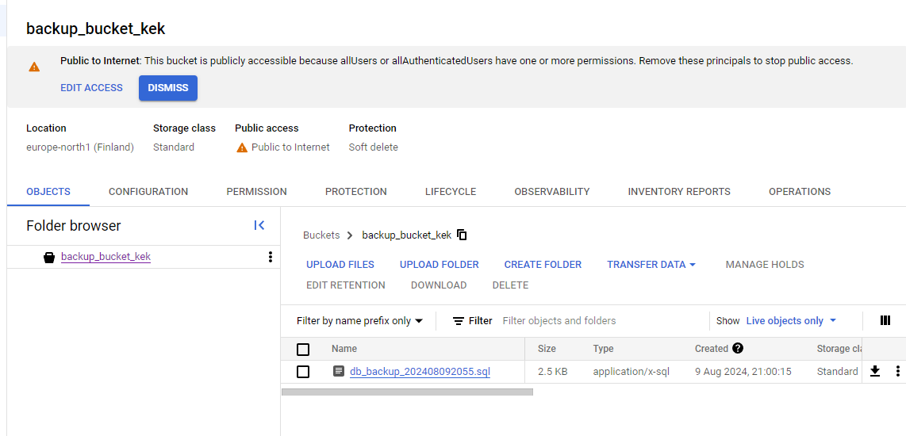

## Used commands

Or, at least some of them. A lot of time was spent just dicking around in the google cloud console configuring permissions. 

```console
$ kubectl create secret generic gcs-credentials --from-file=key.json="XXX\kubernetes-course\part3\3.03\app\key.json"
secret/gcs-credentials created
```


```console
$ docker build -t pyrynot/pg-backup:3.03 -f Dockerfile.pg-backup .

$ docker push pyrynot/pg-backup:3.03
```


```console
$ kubectl create clusterrolebinding default-admin --clusterrole=cluster-admin --serviceaccount=default:default
clusterrolebinding.rbac.authorization.k8s.io/default-admin created
```


