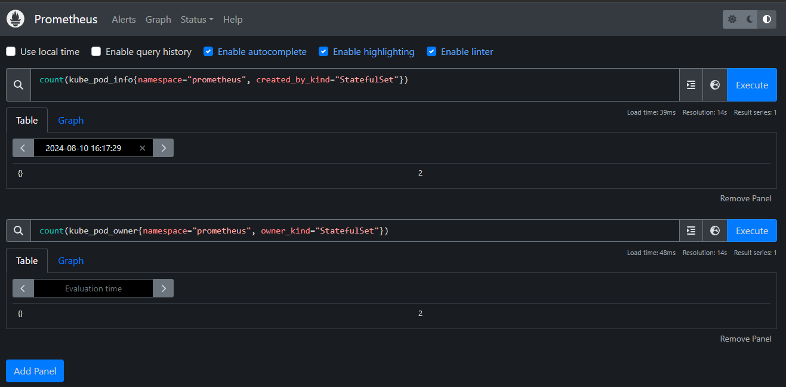

# Queries



count(kube_pod_info{namespace="prometheus", created_by_kind="StatefulSet"})
count(kube_pod_owner{namespace="prometheus", owner_kind="StatefulSet"})


### Investigating discrepancy (in the material it said it should be 3)
Getting pods:

```console
$ kubectl get po -n prometheus
NAME                                                              READY   STATUS    RESTARTS        AGE
prometheus-kube-prometheus-stack-1722-prometheus-0                2/2     Running   2 (3h46m ago)   4d21h
kube-prometheus-stack-1722884256-prometheus-node-exporter-7vr6q   1/1     Running   1 (3h46m ago)   4d21h
kube-prometheus-stack-1722-operator-7759f95dbb-bxlrd              1/1     Running   1 (3h46m ago)   4d21h
kube-prometheus-stack-1722884256-kube-state-metrics-6f65bb4drq7   1/1     Running   1 (3h46m ago)   4d21h
kube-prometheus-stack-1722884256-grafana-b64784547-gbctr          3/3     Running   3 (3h46m ago)   4d20h
kube-prometheus-stack-1722884256-prometheus-node-exporter-glhvq   1/1     Running   1 (3h46m ago)   4d21h
kube-prometheus-stack-1722884256-prometheus-node-exporter-9xn9b   1/1     Running   3 (3h45m ago)   4d21h
alertmanager-kube-prometheus-stack-1722-alertmanager-0            2/2     Running   2 (3h46m ago)   4d21h
```

Listing the owners:
```console
$ kubectl get pods -n prometheus -o=jsonpath='{range .items[*]}{.metadata.name}{"\t"}{.metadata.ownerReferences[*].kind}{"\n"}{end}'
prometheus-kube-prometheus-stack-1722-prometheus-0      StatefulSet
kube-prometheus-stack-1722884256-prometheus-node-exporter-7vr6q DaemonSet
kube-prometheus-stack-1722-operator-7759f95dbb-bxlrd    ReplicaSet
kube-prometheus-stack-1722884256-kube-state-metrics-6f65bb4drq7 ReplicaSet
kube-prometheus-stack-1722884256-grafana-b64784547-gbctr        ReplicaSet
kube-prometheus-stack-1722884256-prometheus-node-exporter-glhvq DaemonSet
kube-prometheus-stack-1722884256-prometheus-node-exporter-9xn9b DaemonSet
alertmanager-kube-prometheus-stack-1722-alertmanager-0  StatefulSet
```

Listing statefulsets:
```console
$ kubectl get statefulsets -n prometheus
NAME                                                   READY   AGE
prometheus-kube-prometheus-stack-1722-prometheus       1/1     4d21h
alertmanager-kube-prometheus-stack-1722-alertmanager   1/1     4d21h
```