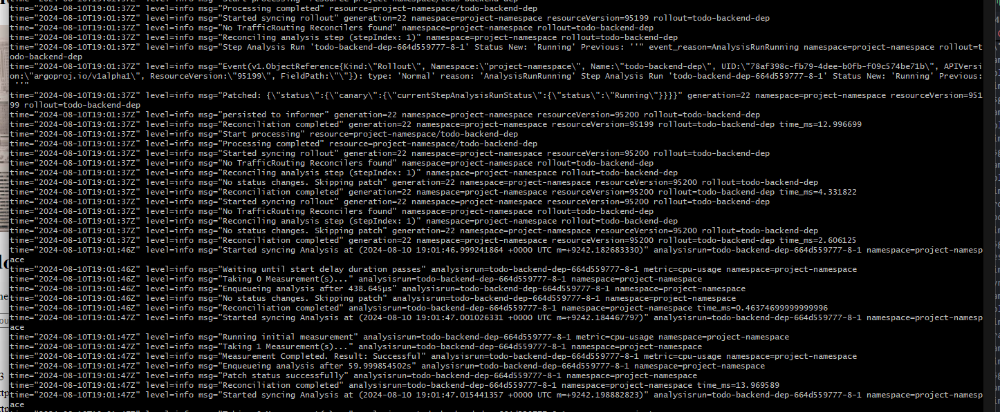
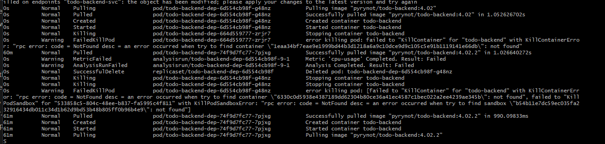

# Commands used

Apparently kustomize doesn't work with argo-rollouts straight out of the box, which made me take a long time with this. God, what a pain.

I also couldn't get the kubectl argo-plugin to work on windows.

The time between steps are 10 seconds in the photos for testing purposes, but they can easily be scaled to 10 minutes based on how many steps one wants, how many replicas, etc.

With successCondition: result[0] <= 500 and failureCondition: result[0] > 500
(rollout goes through)

With successCondition: result[0] <= 0.000000000000005 and failureCondition: result[0] > 0.0000000000000005
(rollout does not go through)

