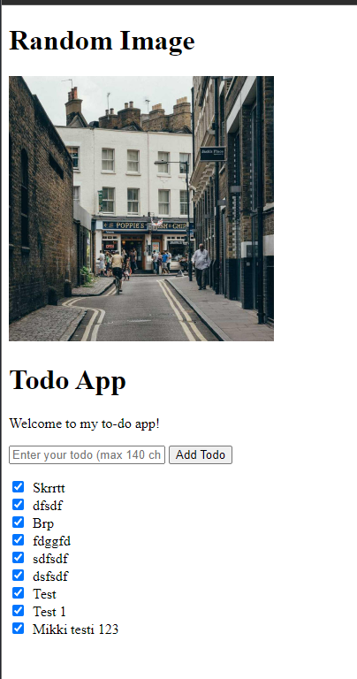

# Commands used:



PUT path added:
```console
$ curl http://localhost:8081/todos
[{"id":1,"content":"Skrrtt","done":true},{"id":3,"content":"dfsdf","done":true},{"id":2,"content":"Brp","done":true},{"id":4,"content":"fdggfd","done":true},{"id":5,"content":"sdfsdf","done":true},{"id":6,"content":"dsfsdf","done":true},{"id":7,"content":"Test","done":true},{"id":8,"content":"Test 1","done":true}](.venv) 

$ curl -X POST http://localhost:8081/todos -H "Content-Type: application/json" -d '{"content": "Mikki testi 123", "done": false}'
{"id":9,"content":"Mikki testi 123","done":false}(.venv) 

$ curl -X PUT http://localhost:8081/todos/9 -H "Content-Type: application/json" -d '{"done": true}'
{"id":9,"content":"Mikki testi 123","done":true}(.venv) 

$ curl http://localhost:8081/todos
[{"id":1,"content":"Skrrtt","done":true},{"id":3,"content":"dfsdf","done":true},{"id":2,"content":"Brp","done":true},{"id":4,"content":"fdggfd","done":true},{"id":5,"content":"sdfsdf","done":true},{"id":6,"content":"dsfsdf","done":true},{"id":7,"content":"Test","done":true},{"id":8,"content":"Test 1","done":true},{"id":9,"content":"Mikki testi 123","done":true}]
```