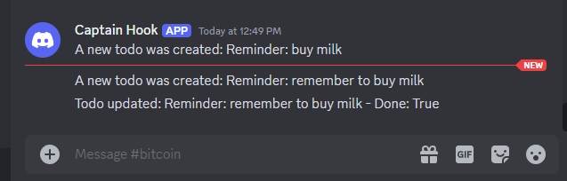

# Commands used




```console
$ curl -X POST http://localhost:8081/todos -H "Content-Type: application/json" -d '{"content": "Reminder: remember to buy milk", "done": false}'
{"id":14,"content":"Reminder: remember to buy milk","done":false}(.venv) 

$ curl -X PUT http://localhost:8081/todos/14 -H "Content-Type: application/json" -d '{"done": true}'
{"id":14,"content":"Reminder: remember to buy milk","done":true}(.venv) 
```

Checking backend logs:
```console
$ kubectl logs todo-backend-dep-56d8fcddf7-lkd4s 
2024-08-11 09:49:18,254 - main - INFO - Created to-do: Reminder: buy milk
2024-08-11 09:49:18,258 - uvicorn.access - INFO - 10.42.1.55:53002 - "POST /todos HTTP/1.1" 200
2024-08-11 09:50:59,787 - main - INFO - Created to-do: Reminder: remember to buy milk
2024-08-11 09:50:59,791 - uvicorn.access - INFO - 10.42.1.55:33586 - "POST /todos HTTP/1.1" 200
2024-08-11 09:51:21,432 - main - INFO - Updated to-do with ID 14: (Done: True)
2024-08-11 09:51:21,435 - uvicorn.access - INFO - 10.42.1.55:34950 - "PUT /todos/14 HTTP/1.1" 200
```


Checking pods:
```console
$ kubectl get po
NAME                                READY   STATUS    RESTARTS   AGE
postgres-ss-0                       1/1     Running   0          14h
my-nats-0                           1/1     Running   0          70m
todo-app-dep-746c5fc68f-jcp2t       1/1     Running   0          38m
todo-backend-dep-56d8fcddf7-lkd4s   1/1     Running   0          38m
broadcaster-dep-76dffdd974-vg4vv    1/1     Running   0          8m52s
broadcaster-dep-76dffdd974-75hqg    1/1     Running   0          8m52s
broadcaster-dep-76dffdd974-xr8rh    1/1     Running   0          8m52s
broadcaster-dep-76dffdd974-z8ck9    1/1     Running   0          8m48s
broadcaster-dep-76dffdd974-gswch    1/1     Running   0          8m48s
broadcaster-dep-76dffdd974-ntnfr    1/1     Running   0          8m48s
```


Checking every pods logs (wow the webhook is in the logs):
```console
$ kubectl logs broadcaster-dep-76dffdd974-
broadcaster-dep-76dffdd974-75hqg  broadcaster-dep-76dffdd974-ntnfr  broadcaster-dep-76dffdd974-xr8rh
broadcaster-dep-76dffdd974-gswch  broadcaster-dep-76dffdd974-vg4vv  broadcaster-dep-76dffdd974-z8ck9

$ kubectl logs broadcaster-dep-76dffdd974-75hqg 
2024-08-11 09:48:30,424 - __main__ - INFO - Starting broadcaster...
2024-08-11 09:48:30,429 - __main__ - INFO - Connected to NATS at nats://my-nats:4222
2024-08-11 09:48:30,429 - __main__ - INFO - Subscribed to 'todos.events' topic with queue group 'broadcaster-group'.      
2024-08-11 09:48:30,429 - __main__ - INFO - Broadcaster is running...

$ kubectl logs broadcaster-dep-76dffdd974-ntnfr 
2024-08-11 09:48:32,634 - __main__ - INFO - Starting broadcaster...
2024-08-11 09:48:32,638 - __main__ - INFO - Connected to NATS at nats://my-nats:4222
2024-08-11 09:48:32,638 - __main__ - INFO - Subscribed to 'todos.events' topic with queue group 'broadcaster-group'.      
2024-08-11 09:48:32,638 - __main__ - INFO - Broadcaster is running...

$ kubectl logs broadcaster-dep-76dffdd974-xr8rh 
2024-08-11 09:48:30,471 - __main__ - INFO - Starting broadcaster...
2024-08-11 09:48:30,476 - __main__ - INFO - Connected to NATS at nats://my-nats:4222
2024-08-11 09:48:30,476 - __main__ - INFO - Subscribed to 'todos.events' topic with queue group 'broadcaster-group'.      
2024-08-11 09:48:30,476 - __main__ - INFO - Broadcaster is running...

$ kubectl logs broadcaster-dep-76dffdd974-gswch 
2024-08-11 09:48:32,085 - __main__ - INFO - Starting broadcaster...
2024-08-11 09:48:32,090 - __main__ - INFO - Connected to NATS at nats://my-nats:4222
2024-08-11 09:48:32,091 - __main__ - INFO - Subscribed to 'todos.events' topic with queue group 'broadcaster-group'.      
2024-08-11 09:48:32,091 - __main__ - INFO - Broadcaster is running...
2024-08-11 09:49:18,257 - __main__ - INFO - Sending message to Discord: A new todo was created: Reminder: buy milk        
2024-08-11 09:49:18,600 - httpx - INFO - HTTP Request: POST https://discord.com/api/webhooks/XXXXXXXXXXXXX "HTTP/1.1 204 No Content"

$ kubectl logs broadcaster-dep-76dffdd974-vg4vv
2024-08-11 09:48:30,387 - __main__ - INFO - Starting broadcaster...
2024-08-11 09:48:30,392 - __main__ - INFO - Connected to NATS at nats://my-nats:4222
2024-08-11 09:48:30,392 - __main__ - INFO - Subscribed to 'todos.events' topic with queue group 'broadcaster-group'.      
2024-08-11 09:48:30,392 - __main__ - INFO - Broadcaster is running...
2024-08-11 09:51:21,436 - __main__ - INFO - Sending message to Discord: Todo updated: Reminder: remember to buy milk - Done: True
2024-08-11 09:51:21,825 - httpx - INFO - HTTP Request: POST https://discord.com/api/webhooks/XXXXXXXXXXXXX "HTTP/1.1 204 No Content"

$ kubectl logs broadcaster-dep-76dffdd974-z8ck9
2024-08-11 09:48:32,479 - __main__ - INFO - Starting broadcaster...
2024-08-11 09:48:32,487 - __main__ - INFO - Connected to NATS at nats://my-nats:4222
2024-08-11 09:48:32,487 - __main__ - INFO - Subscribed to 'todos.events' topic with queue group 'broadcaster-group'.      
2024-08-11 09:48:32,487 - __main__ - INFO - Broadcaster is running...
2024-08-11 09:50:59,790 - __main__ - INFO - Sending message to Discord: A new todo was created: Reminder: remember to buy milk
2024-08-11 09:51:00,180 - httpx - INFO - HTTP Request: POST https://discord.com/api/webhooks/XXXXXXXXXXXXX "HTTP/1.1 204 No Content"
```