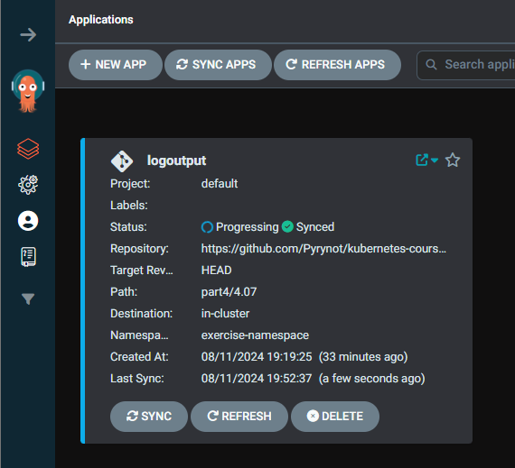
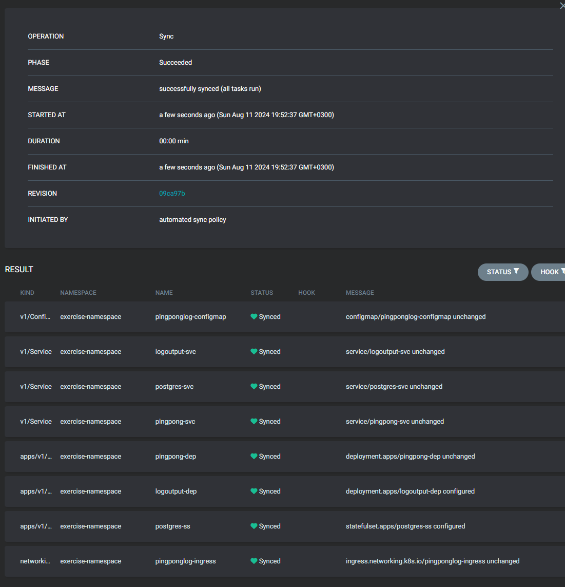

# Commands used


Port-forwarding:
```console
kubectl port-forward svc/argocd-server -n argocd 8080:443
```

Getting the password:
```console
$ kubectl -n argocd get secret argocd-initial-admin-secret -o jsonpath="{.data.password}" | base64 -d
```


app created with this:


```yaml
apiVersion: argoproj.io/v1alpha1
kind: Application
metadata:
  name: logoutput
  namespace: argocd
spec:
  destination:
    namespace: exercise-namespace
    server: https://kubernetes.default.svc
  source:
    path: part4/4.07
    repoURL: https://github.com/Pyrynot/kubernetes-course.git
    targetRevision: HEAD
  project: default
  syncPolicy:
    syncOptions:
      - CreateNamespace=true
```




