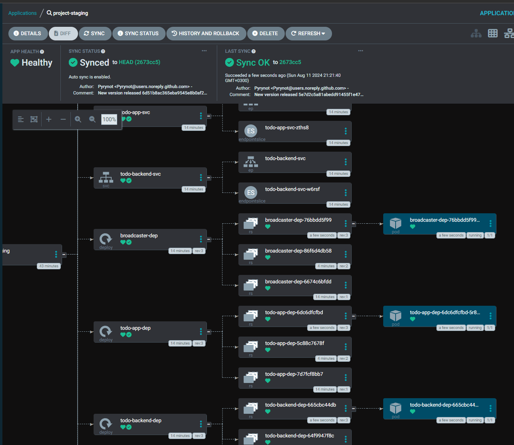
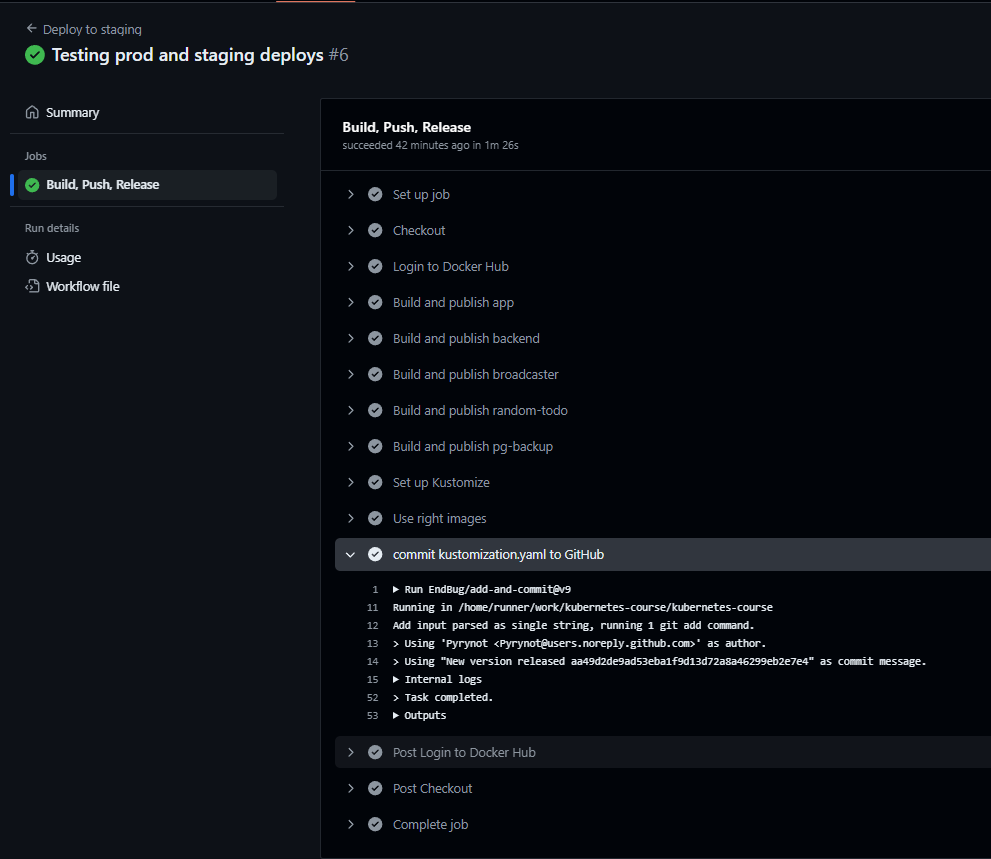
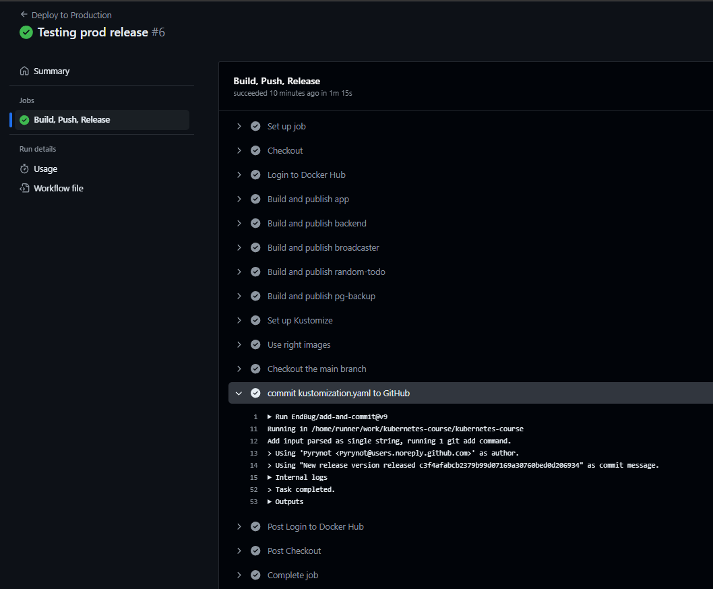

# Commands used:


Staging namespace:




Depploying to staging on push to the main branch:


Deploying to production with a tag push:


Broadcaster not forwarding messages in staging was achieved with an env variable in prod:

```Python
STAGING_ENV = os.getenv("STAGING_ENV", True)
..........
if message:
    logger.info(f"Sending message to Discord: {message}")
    if not STAGING_ENV:
        await send_to_discord(message)
```