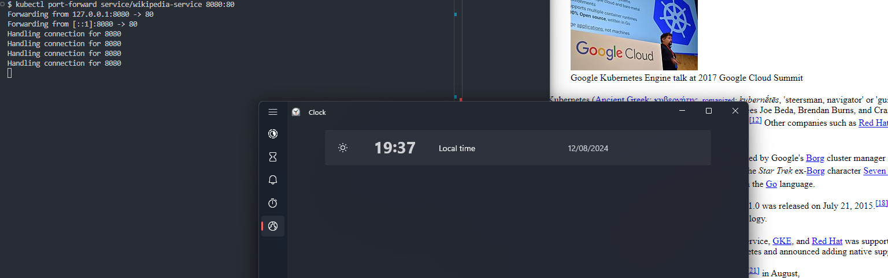
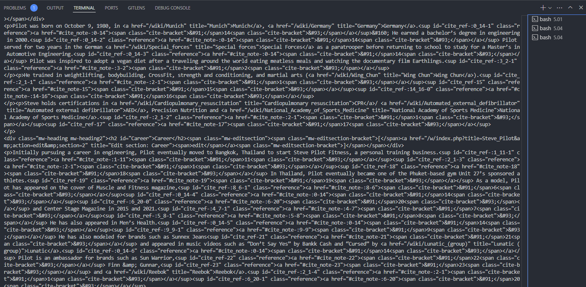

# Commands used




Applying the pod:
```console
kubectl apply -f wikipedia-app.yaml
```

Port-forwarding the pod:
```console
kubectl port-forward pod/wikipedia-pod 8080:80
```

Checking the logs of the sidecar to see when the site changes:
```console
$ kubectl logs wikipedia-pod -c sidecar-random-wikipedia -f
  % Total    % Received % Xferd  Average Speed   Time    Time     Time  Current
                                 Dload  Upload   Total   Spent    Left  Speed
  0     0    0     0    0     0      0      0 --:--:-- --:--:-- --:--:--     0
100 59398    0 59398    0     0  62581      0 --:--:-- --:--:-- --:--:--  816k
```

New random site:
