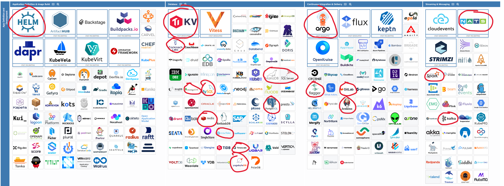
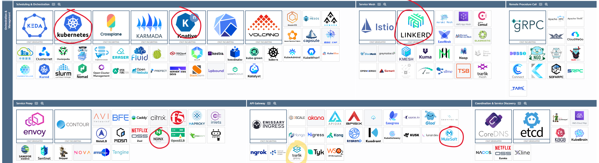
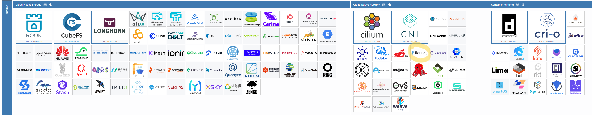
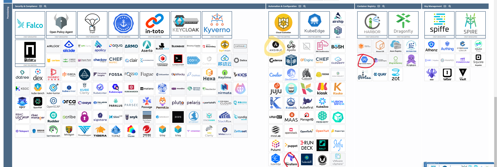
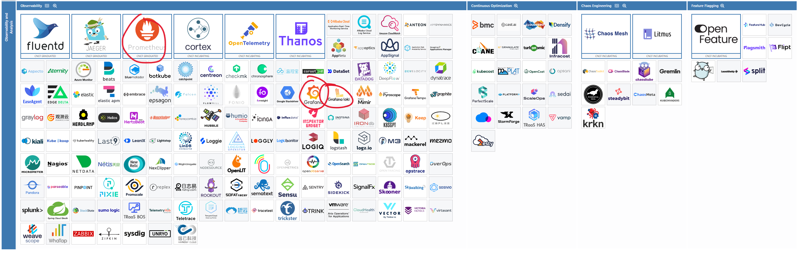

I used HELM in many parts of the course
I used KV to go serverless
I used argo to do rollout deployments and automated CI/CD pipelines
I used flagger to do a canary release with service mesh
I used NATS to implement a discord bot
I used kubernetes
I used knative to go serverless
I used linkerd in the course
I used nginx in the course
I used prometheus to implement logging
I used grafana and grafana loki to implement logging
I used google container registry in the course to push images

I used traefik in the course, but dont know what it is
I used flannel as k3d needs it, but dont know what it is
I used ansible in the course, but dont know what it is

Used outside the course: CockroachDB, MariaDB, SQL Server, mongoDB, MySQL, redis, Snowflake, TimescaleDB, YugabyteDB, Gitlab, Jenkins, Spark, Kafka, Mulesoft, Terraform